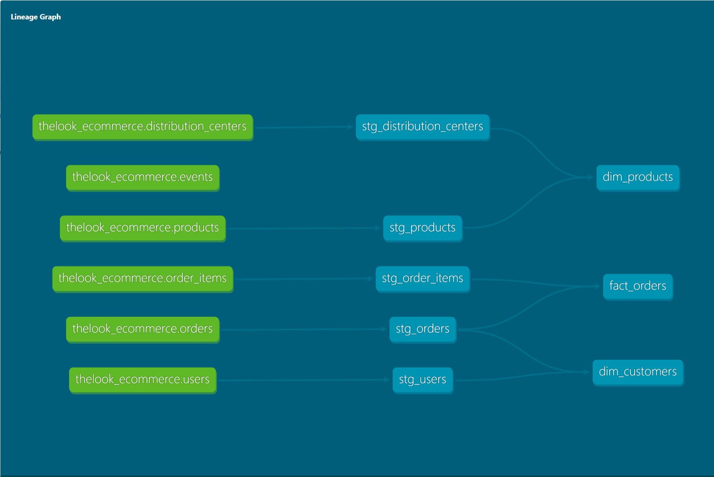

# dbt E-Commerce Analytics 

A lightweight dbt project transforming Google's public `thelook_ecommerce` dataset into a staging → star schema analytics layer on BigQuery. 

## Stack 
- **Transformation:** dbt Core (v1 engine) 
- **Warehouse:** Google BigQuery (Sandbox, free tier) 
- **Source data:** `bigquery-public-data.thelook_ecommerce` 
- **Version control:** GitHub 

## Architecture 

Staging (views) → Marts (tables, star schema) 

- **Staging:** 1:1 cleaned views of source tables (renamed/typed columns only, no business logic) 
- **Marts:** 
    - `dim_customers` - customer profile + lifetime order metrics 
    - `dim_products` - product catalog + margin + distribution center 
    - `fact_orders` - order line-item grain fact table 

 

## Setup 

1. Clone the repo 
2. Create a virtual environment and install dependencies: 
    ```powershell 
    python -m venv venv 
    .\venv\Scripts\Activate.ps1
    pip install dbt-core dbt-bigquery
    ```
3. Configure `~/.dbt/profiles.yml` with your own GCP service account 
4. Run: 
    ```powershell 
    dbt debug 
    dbt run 
    dbt test 
    dbt docs generate && dbt docs serve 
    ```

